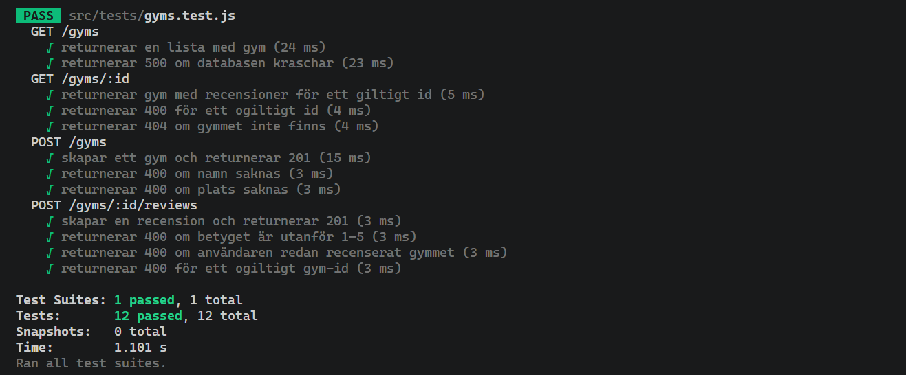
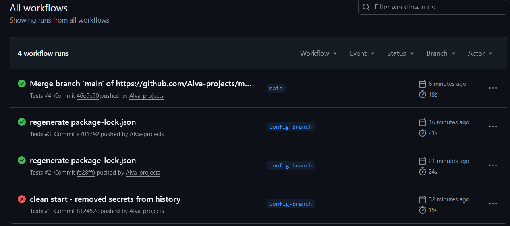

# GymReviews

En webbapp där användare kan hitta gym, läsa recensioner och skriva egna. Inloggning sker via Google (Firebase Auth).

## Tech stack

- **Frontend** — Vanilla HTML/CSS/JavaScript
- **Backend** — Node.js, Express
- **Databas** — MongoDB (Mongoose)
- **Auth** — Firebase Authentication (Google Sign-In)
- **Tester** — Jest + Supertest
- **CI** — GitHub Actions

---

## Kom igång

### Krav

- [Node.js](https://nodejs.org/) v18+
- [MongoDB](https://www.mongodb.com/) (lokal installation eller MongoDB Atlas)
- Ett Firebase-projekt med Google Sign-In aktiverat

### 1. Klona repot

```bash
git clone https://github.com/Alva-projects/module_3_summative_assessment.git
cd module_3_summative_assessment
```

### 2. Installera dependencies

```bash
cd backend
npm install
```

### 3. Konfigurera environment variabler

Skapa en fil `backend/.env` med följande innehåll:

```
MONGO_URI=mongodb://localhost:27017/gymreviews
FIREBASE_API_KEY=din-firebase-api-nyckel
FIREBASE_PROJECT_ID=ditt-firebase-projekt-id
```

### 4. Lägg till Firebase-nyckel

Ladda ner din servicekontonyckel från Firebase Console:  
**Project Settings → Service Accounts → Generate new private key**

Spara filen som `backend/serviceAccountKey.json`.  
Committa inte den här filen — den finns redan i `.gitignore`.

### 5. Starta servern

```bash
cd backend
npm start
```

Öppna (http://localhost:3000) i webbläsaren.

---

## Användning

| Funktion | Kräver inloggning |
|---|---|
| Se alla gym | Nej |
| Se recensioner för ett gym | Nej |
| Lägga till ett gym | Ja |
| Skriva en recension | Ja |
| Se sin profil | Ja |

1. Klicka **Sign In** och logga in med Google
2. Klicka **+ Add Gym** för att lägga till ett gym
3. Klicka på ett gymkort för att öppna det
4. Klicka **+ Write Review** för att skriva en recension (1–5 stjärnor)

---

## Kör tester

```bash
cd backend
npm test
```

Testerna använder mockade versioner av databasen och Firebase. Ingen riktig anslutning behövs.

---

## CI/CD

GitHub Actions kör testerna automatiskt vid varje push och pull request. Status syns under fliken **Actions** på GitHub.

## Screenshots

